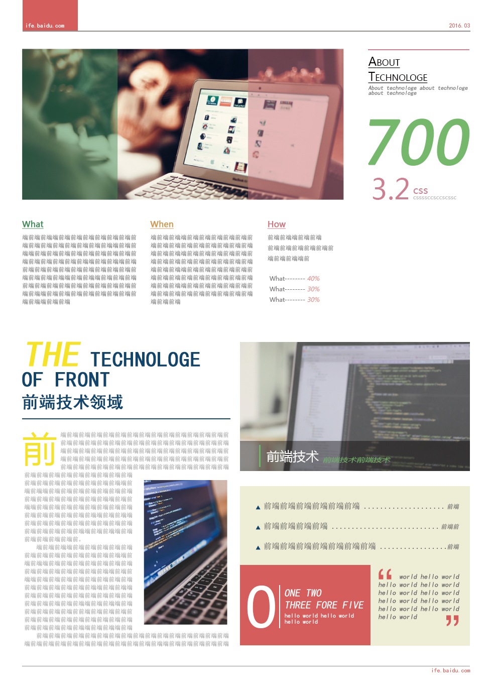
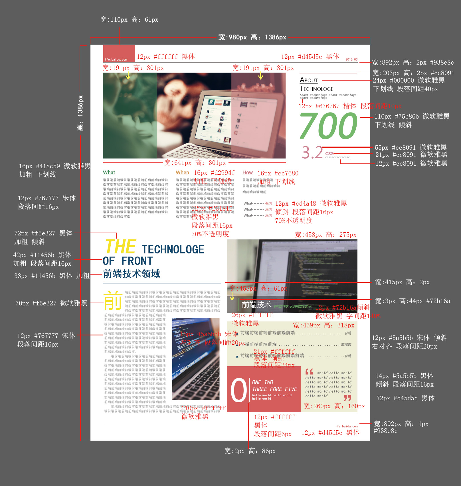

# 任务六 通过HTML及CSS模拟报纸排版

## 任务目的

- 深入掌握CSS中的字体、背景、颜色等属性的设置

- 进一步练习CSS布局

## 任务描述

- 参考PDS设计稿，实现页面开发，要求实现效果与样例基本一致

- 页面中的各字体大小，内外边距等可参看标注图

- 页面宽度固定（定宽）

## 注意事项

- 只需要完成HTML，CSS代码编写，不需要写JavaScript

- 设计稿中的图片、文案均可自行设定

-在Chrome中完美实现符合标注中的各项说明

- 有能力的同学可以尝试跨浏览器的兼容性

- 有能力的同学可以在实现一遍后尝试用less, sass或者stylus等再实现一次