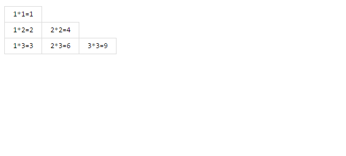

- 实现一个九九乘法表



```JavaScript
        // 渲染乘法表
        function mult(num) {
            var ul = document.getElementById('ul');
            for (var i = 1; i <= num; i++) {
                var li = document.createElement('li');
                for (var j = 1; j <= i; j++) {
                    var span = document.createElement('span');
                    span.innerHTML = i + '*' + j + '=' + i * j;
                    span.style.display = 'none'; //默认隐藏
                    li.appendChild(span);
                }
                ul.appendChild(li);
            }
            animate();
        }

        // 展示动画
        function animate() {
            var span = ul.getElementsByTagName('span');
            var _index = 0;
            var timer = setInterval(function() {
                span[_index].style.display = 'inline-block';
                _index++;
                if (_index >= span.length) {
                    clearInterval(timer)
                }
            }, 100);
        }
        // 启动
        mult(9)
```